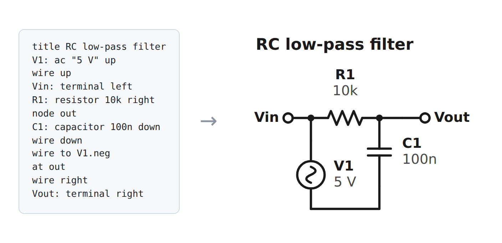

# circuitmark

**Write a circuit diagram as a few lines of text; get a clean SVG. Mermaid-style, for schematics.**

[](https://github.com/kosys0224-spec/circuitmark/actions/workflows/ci.yml)
[](https://www.python.org/)
[](pyproject.toml)
[](LICENSE)



```bash
pipx install git+https://github.com/kosys0224-spec/circuitmark
circuitmark render filter.ckt                      # -> filter.svg
circuitmark md README.md --svg-dir docs/circuits -i  # render every ```circuit block in a Markdown file
```

No dependencies, no GUI, no layout engine to fight: you say where things go, in grid units, with a cursor that walks the circuit the way you would draw it on paper. The output is a small deterministic SVG that diffs well in git.

## Why

Documentation for electronics projects, lab reports, course notes and firmware repos usually has diagrams drawn in a GUI tool and pasted in as a PNG. They go stale, nobody can edit them without the original file, and they do not review in a pull request. Text diagrams fixed that for flowcharts and sequence diagrams (Mermaid, PlantUML); circuit schematics have been [requested in Mermaid for years](https://github.com/mermaid-js/mermaid/issues/2112) and still need either LaTeX (`circuitikz`) or a Python drawing library with a script per figure.

circuitmark is the small, text-first middle: a file format you can read in a code review, a renderer with no dependencies, and a Markdown mode so a schematic can live next to the paragraph that explains it.

## The language in one example

```text
title NPN low-side switch driving an LED
VCC: terminal up label "+9 V"
wire down
RL: resistor 470 down
D1: led down label "red"
wire down
node c
at 0,11                 # grid coordinates: x right, y down
Q1: npn up              # emitter at the start (bottom), collector at the end (top)
at Q1.e
GND1: ground down
at Q1.base
wire left
RB: resistor 4k7 left
IN: terminal left label "GPIO"
```


- **Elements** — `ID: kind value direction`. The element starts at the cursor and the cursor moves to its far end. Kinds: resistor, capacitor, inductor, diode, led, zener, schottky, battery, dc, ac, isource, switch, fuse, lamp, motor, speaker, box, npn, pnp, opamp, ground, terminal, dot (`circuitmark symbols` lists aliases).
- **Wires** — `wire down 2` for straight runs, `wire to V1.neg` for an automatic L-shaped connection to any pin, named node or coordinate.
- **Navigation** — `node name` names the current point, `at name` / `at R1.end` / `at 4,2` jumps there without drawing.
- **Polarity** — negative/anode at the start, positive/cathode at the end; `flip` reverses it, `mirror` reflects across the axis (base side of a transistor).
- **Labels** — the id and the value are placed automatically and move out of the way of neighbours; `label "text" below` overrides.
- **Junctions** — dots appear where three or more connections meet; an end with only one connection is reported as a *dangling connection* with its line number, so `circuitmark check -W` catches broken diagrams in CI.

Full syntax: [docs/syntax.md](docs/syntax.md). More diagrams with their source: [examples/](examples/README.md).

## Markdown

Put a diagram in a fenced block:

````markdown
```circuit
title Voltage divider
Vin: terminal left
R1: resistor 10k right
node mid
R2: resistor 10k down
GND: ground down
at mid
wire up
Vout: terminal up
```
````

Then either inline the SVG (works with MkDocs, Hugo, Jekyll, Sphinx-MyST, most wikis):

```bash
circuitmark md docs/notes.md -o site/notes.md
```

or, for GitHub READMEs (which strip inline SVG), write files and link them:

```bash
circuitmark md README.md --svg-dir docs/circuits --in-place --keep-source
```

`--keep-source` leaves the text in a collapsed `<details>` block under the image so readers can copy and edit it. `--theme auto` produces SVGs in `currentColor` with no background, so an inlined diagram follows your site's dark mode.

## Command line

```text
circuitmark render FILE.ckt [FILE2.ckt ...] [-o OUT.svg | -o DIR] [--theme light|dark|blueprint|transparent|auto] [--scale N] [-W]
circuitmark md FILE.md [...] [-o OUT | -i] [--svg-dir DIR] [--link-prefix P] [--keep-source] [--theme T]
circuitmark check FILE.ckt|FILE.md [...] [-W]      # parse + layout only; -W makes warnings fail
circuitmark symbols                                # kinds, aliases, pin names
cat diagram.ckt | circuitmark render - > out.svg
```

Errors carry `file:line:` and a hint (`unknown element kind 'resistr' — did you mean resistor?`), so they show up in editors and CI logs like compiler errors.

## Python API

```python
from circuitmark import render
svg = render("V1: battery 9V up\nR1: resistor 1k right\nwire down 3\nwire to V1.neg", theme="auto")
```

`parse()` → statements, `layout()` → absolute geometry (elements, pins, wires, junctions, labels, warnings), `render_svg()` → string. Everything is plain dataclasses; a different back-end (PNG, TikZ, a netlist) only needs the `Drawing` object.

## Limits

- Manhattan geometry only: components lie on the grid, horizontally or vertically. No diagonal diodes in a bridge rectifier (draw it as a square), no curved wires.
- The parts list is the common two-terminal set plus BJTs and an op-amp. No MOSFETs, logic gates, connectors or multi-pin ICs yet (use `box` with a label for a chip and `terminal`s for its pins).
- Label collision avoidance tries the two sides of an element and stops there; in dense drawings, move things apart or use `label ... SIDE`.
- SVG only. For PNG/PDF, pass the SVG through `rsvg-convert`, Inkscape or a browser.
- It draws what you tell it. It does not simulate, check Kirchhoff, or know that a resistor labelled `4k7` is 4.7 kΩ.

## Roadmap

- [ ] PyPI release
- [ ] MOSFET (nmos/pmos), transformer, crystal, potentiometer, logic gates
- [ ] `--png` via an optional cairosvg/resvg back-end
- [ ] Current-flow / voltage arrows and annotations (`arrow`, `measure`)
- [ ] mkdocs plugin and a pre-commit hook definition
- [ ] Export: KiCad netlist from the connectivity that is already computed for junction detection

## Contributing

New symbols are the easiest contribution: a symbol is one function returning a few path strings in a 60×30 px local frame (see `src/circuitmark/symbols.py`), plus a line in `docs/syntax.md` and a test. See [CONTRIBUTING.md](CONTRIBUTING.md). Tests are offline and instant: `python -m unittest discover -s tests -v`.

## License

[MIT](LICENSE) © 2026 Inhyeok Park
