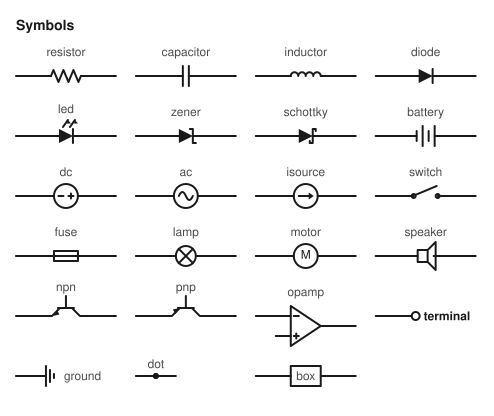

# circuitmark syntax

A circuitmark file is a list of statements, one per line. Everything after `#` is a comment. Blank lines are ignored.

You draw with a **cursor** that has a position and a heading, like a turtle: every element or wire starts at the cursor and moves it to its far end. The grid unit is 20 px; a two-terminal element is 3 units long.

## Statements

| Statement | Meaning |
|---|---|
| `title TEXT` | Title drawn above the diagram and used as the SVG `<title>` / image alt text. |
| `[ID:] KIND [VALUE] [DIRECTION] [len N] [flip] [mirror] [label "TEXT" [SIDE]] [noid]` | Place an element at the cursor. |
| `wire [DIRECTION] [UNITS]` | Straight wire, default 1 unit in the current heading. |
| `wire to ANCHOR [vfirst]` | Manhattan wire to an anchor: horizontal leg first, then vertical (`vfirst` swaps the order). |
| `node NAME` | Give the current cursor position a name. |
| `at ANCHOR` | Move the cursor without drawing. |
| `label "TEXT" [SIDE]` | Change the text and/or side of the previous element's value label. |

`DIRECTION` is `up`, `down`, `left`, `right` (or `u d l r`, `north south east west`). When omitted, the element continues in the current heading (initially `right`).

`VALUE` is a single token, or a quoted string when it has spaces: `"9 V"`, `"1N4148"`. It is drawn as the value label.

`SIDE` is `above`, `below`, `left`, `right`, `inside`, or `none` (hide the value label). `noid` hides the id label.

`len N` (or `xN`) multiplies the element's length: `R1: resistor 1k right len 2` is 6 units long; the symbol body stays the same size, the leads get longer.

## Anchors

| Form | Example | Refers to |
|---|---|---|
| node name | `wire to out` | a point named with `node` |
| `ID.PIN` | `wire to V1.neg`, `at Q1.base` | a pin of an element with an id |
| `X,Y` | `at 4,-2` | grid coordinates (x to the right, y **downward**, like the screen; the first element starts at `0,0`) |
| bare `ID` | `at GND1` | only for one-pin elements (ground, terminal, dot) |

### Pin names

| Elements | Pins |
|---|---|
| all two-terminal parts | `.start` / `.end` (also `.1` / `.2`) — geometric ends, where the element began and where it ended |
| battery, dc, ac, isource | `.neg` / `.pos` (also `.-` / `.+`) — electrical, follow `flip` |
| diode, led, zener, schottky | `.anode` / `.cathode` (also `.a` / `.k`) |
| npn, pnp | `.e` (start), `.c` (end), `.b` / `.base` — the base pin is one unit to the left of the axis when drawn upward; `mirror` puts it on the right |
| opamp | `.in-` (= `.start`), `.in+` (one unit beside it), `.out` (= `.end`) |

## Polarity: `flip` and `mirror`

Polarised symbols are drawn with their **negative / anode end at the start** of the element and the positive / cathode end at the far end. So `V1: battery up` has `+` at the top, and `D1: diode right` conducts left-to-right.

- `flip` mirrors the symbol end-for-end: the electrical pins (`.pos`, `.cathode` …) swap, the geometric pins (`.start`, `.end`) do not. Use it for a flyback diode drawn downward with the cathode at the top: `D1: diode down flip`.
- `mirror` reflects across the element's axis. It moves the base of a transistor, the inputs of an op-amp and the arrows of an LED to the other side.

## Elements

Run `circuitmark symbols` for the list with aliases. The sheet below is `docs/symbols.ckt`.



| Kind | Aliases | Notes |
|---|---|---|
| resistor | r, res | |
| capacitor | c, cap | |
| inductor | l, ind, coil | |
| diode | d | anode at start |
| led | | diode with light arrows |
| zener | | |
| schottky | | |
| battery | bat, cell | short thick plate = negative, at start |
| dc | vdc, vsource, source, v | circle with + and − |
| ac | vac, sine | |
| isource | i, idc, current | arrow towards the end |
| switch | sw, s | open switch |
| fuse | f | |
| lamp | bulb, light | |
| motor | m | |
| speaker | spk, buzzer | |
| box | block, ic, generic | rectangle; the value is written inside |
| npn, pnp | | three pins, see above |
| opamp | amp | three pins, see above |
| ground | gnd, earth | one pin; the cursor stays put |
| terminal | term, port, pin | open circle; the label is the value, or the id when there is no value |
| dot | junction, j | explicit junction dot (junctions are normally detected automatically) |

## Junctions and warnings

A point where three or more things meet (wire ends, element pins, or a wire ending on the middle of another wire) gets a junction dot automatically.

A point with only **one** connection that is not a `terminal` or `ground` is reported as a *dangling connection* with the line number that created it. `circuitmark check -W` turns these into a non-zero exit status, which makes a useful CI check for documentation. Add a `terminal` to mark an intentionally open end.

## Labels

Each element gets up to two labels: the **id** (bold) and the **value**. They are stacked above a horizontal element and to the right of a vertical one. If that side collides with another element, wire or label, the stack moves to the opposite side. `label "TEXT" SIDE` (inline, or on the following line) overrides the value text and side.

## Markdown

```circuit
title Anything in a ```circuit fence
R1: resistor 1k right
wire right
wire left 4
```

`circuitmark md FILE.md` replaces every ```` ```circuit ```` (or ```` ```ckt ````) block. By default the SVG is inlined into the Markdown, which works on most static-site generators. GitHub strips inline SVG, so for READMEs use `--svg-dir docs/circuits --in-place`: the diagrams are written as files and the block becomes ``. `--keep-source` keeps the text in a `<details>` block under the picture so readers can copy it.

## Themes

`--theme light` (default, white background), `dark`, `blueprint`, `transparent` (no background), and `auto` (no background, strokes and text in `currentColor`, so the SVG inherits the colour of the page it is inlined in).
