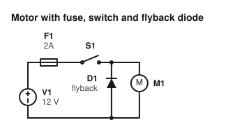
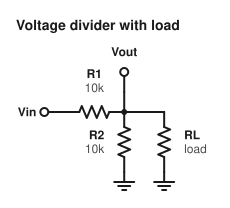
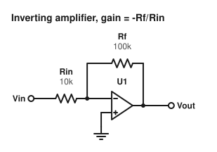
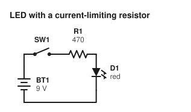
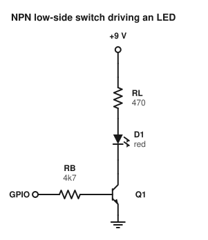
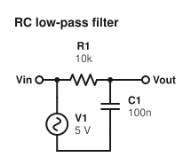

# Examples

Each `.ckt` file in this directory, rendered with `circuitmark render`. Regenerate with `python scripts/make_docs.py`.

## Motor with fuse, switch and flyback diode



```circuit
title Motor with fuse, switch and flyback diode
V1: dc "12 V" up
wire up
F1: fuse 2A right
S1: switch right
node top
wire right 2
M1: motor down
wire down
wire to V1.neg
at top
D1: diode down flip label "flyback"
wire down
```

## Voltage divider with load



```circuit
title Voltage divider with load
Vin: terminal left
R1: resistor 10k right
node mid
R2: resistor 10k down
GND1: ground down
at mid
wire right 2
RL: resistor 100k down label "load"
GND2: ground down
at mid
wire up
Vout: terminal up
```

## Inverting amplifier, gain = -Rf/Rin



```circuit
title Inverting amplifier, gain = -Rf/Rin
Vin: terminal left
Rin: resistor 10k right
node inm
wire right
# an op-amp starts at in-; in+ is one unit below, the output is at the far end
U1: opamp right
wire right
Vout: terminal right
# feedback from the output back to the inverting input
at U1.out
wire up 3
Rf: resistor 100k left
wire to inm
# non-inverting input to ground
at U1.in+
wire down
GND1: ground down
```

## LED with a current-limiting resistor



```circuit
title LED with a current-limiting resistor
BT1: battery "9 V" up
wire up
SW1: switch right
R1: resistor 470 right
D1: led down label "red"
wire down
wire to BT1.neg
```

## NPN low-side switch driving an LED



```circuit
title NPN low-side switch driving an LED
# supply rail
VCC: terminal up label "+9 V"
wire down
RL: resistor 470 down
D1: led down label "red"
wire down
node c
# the transistor is drawn upward: emitter at the start (bottom), collector at the end (top) = node c
at 0,11
Q1: npn up
at Q1.e
GND1: ground down
# base drive from a logic pin on the left
at Q1.base
wire left
RB: resistor 4k7 left
IN: terminal left label "GPIO"
```

## RC low-pass filter



```circuit
title RC low-pass filter
V1: ac "5 V" up
wire up
Vin: terminal left
R1: resistor 10k right
node out
C1: capacitor 100n down
wire down
wire to V1.neg
at out
wire right
Vout: terminal right
```
